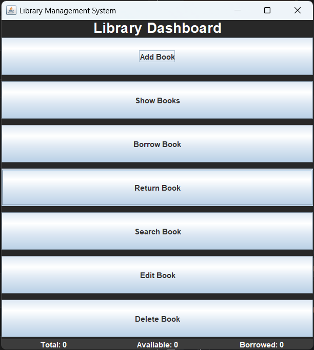

# Library Management System

A desktop-based Library Management System built using Java and Java Swing.  
The application allows users to manage books, track borrowing activity, and maintain library records through an interactive graphical interface.

## Features
- Login authentication
- Add, edit, delete books
- Borrow and return books
- Search books
- Table display of books
- Dashboard statistics
- File storage

## Technologies
- Java
- Java Swing
- Object-Oriented Programming (OOP)
- File Handling

## Run

Run `LoginGUI.java`

Default login:

Username: admin  
Password: 1234

## Screenshots

### Login Screen

### Dashboard

